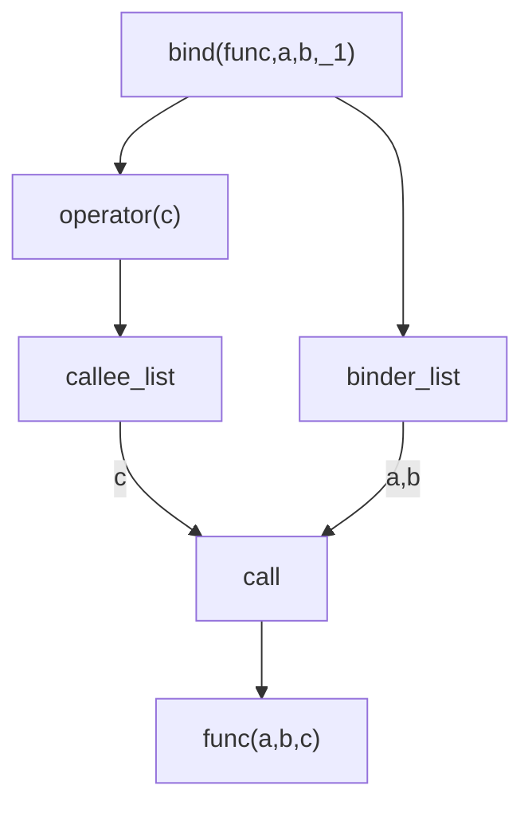

---
title: "Bind的简单实现剖析"
date: 2022-08-22T00:20:21+08:00
draft: true
# tags: [ "" ]
categories: [ "C++"]
# keywords: [ ""]
# lastmod: 2022-08-22T00:20:21+08:00
# CJKLanguage: Chinese, Japanese, Korean
isCJKLanguage: true
slug: "402a1cee"
toc: true
mermaid: true
# latex support
# katex: true
# markup: mmark
# mmarktoc: false 
---

本来想剖析下UE的Delegate的实现，想到一直想看下bind的实现就干脆看看bind的。
翻了下`EASTL`，发现其拒绝实现`bind`，因为lambda是bind的上位替换(见effective modern cpp item 34 [条款三十四：考虑lambda而非std::bind](https://github.com/CnTransGroup/EffectiveModernCppChinese/blob/master/src/6.LambdaExpressions/item34.md))。

又翻了下llvm的`libcxx`，标准库里的代码真的很难看懂。。
最后发现一个gist实现了个简易版的bind(https://gist.github.com/Redchards/c5be14c2998f1ca1d757)，虽然不是完全符合标准，但是也能基本实现bind的基本功能

```cpp

int foo(int a,int b,int c)
{
    return a + b + c;
}

auto func = bind(foo,1,2,std::placeholder::_1);

func(3); // return 1 + 2 + 3 = 6
```

就从这个gist开始吧。

# bind



其代码大致流程如上。
当`bind`被调用时:

1. 参数列表被保存在`binder_list`里，返回一个`binder`对象
2. `binder->operator(args...)`被调用时，参数被保存在`callee_list`里，并且根据占位符`_1`,`_2`的标志来从`callee_list`里取出对应的实参
3. 填充完所有形参后，执行实际的函数调用

注意，所有的计算**可以**均发生在**编译期**，也就是这些参数的保存之类的在运行期都是0开销，在编译结束的时候，bind的调用均被转换为实际的函数调用。

# binder_list

```cpp
template<size_t n>
using index_constant = std::integral_constant<size_t, n>;
template<class ... Args>
class binder_list
{
public:
	template<class ... TArgs>
	constexpr binder_list(TArgs&&... args) noexcept
	: boundedArgs_{std::forward<TArgs>(args)...}
	{}
	
	template<size_t n>
	constexpr decltype(auto) operator[](index_constant<n>) noexcept
	{
		return std::get<n>(boundedArgs_);
	}
	
private:
	std::tuple<Args...> boundedArgs_;	
};
```

没什么太多好说的，其主要将传进来的参数列表保存在一个`tuple`里，并且提供一个`operator[constant]`返回对应的值。


写一些简单的函数语句来测试`binder_list`，见(https://godbolt.org/z/brc36TbaT)。

注意`binder_list`无法被直接创建，会提出无法推导`std::tuple`的类型，所以需要创建一个变参函数来推导(搞不懂这里的规则)

```cpp
binder_list lst(1,2,3); // will be error, cannot deduce type from args list
// -> translated into
std::tuple(1,2,3)
```

```cpp
template <class ...Args>
decltype(auto) make_binder_list(Args&&... args)
{
    // 利用变参函数作为模版参数使得tuple能够正常创建
    return binder_list<Args...>{std::forward<Args>(args)...};
}

int main()
{
    using namespace std::placeholders;
    // binder_list lst(1,2,3); // will be error, cannot deduce type from args list
    auto lst = make_binder_list(1,2,_1);
    std::cout << lst[index_constant<0>()]<< std::endl; // 1
    std::cout << lst[index_constant<1>()]<< std::endl; // 2
    // 注意binder_list内保存的会是`const placeholder::_1 &`类型，所以
	std::remove_reference<decltype(lst[index_constant<2>()])>::type b; // std::placeholder::_1
	std::cout << std::is_same<decltype(b), decltype(std::placeholders::_1)>::value << std::endl; // 1
    std::cout << std::is_placeholder<std::remove_reference<decltype(lst[index_constant<2>()])>::type >::value << std::endl; // 1

}
```

为什么`binder_list`保存的会是`const placeholder::_1 &`类型呢

```cpp
struct A{};
constexpr A _a{};

template <class Arg>
decltype(auto) foo(Arg&& arg) {return arg;}

// 这里触发了引用折叠规则， foo函数的Arg推导出来为A&, 变成 A& && arg = A& arg
// constexpr退化为const

int main()
{
    std::cout << std::is_same<const A&, decltype(foo(_a))>::value << std::endl; // 1
}
```